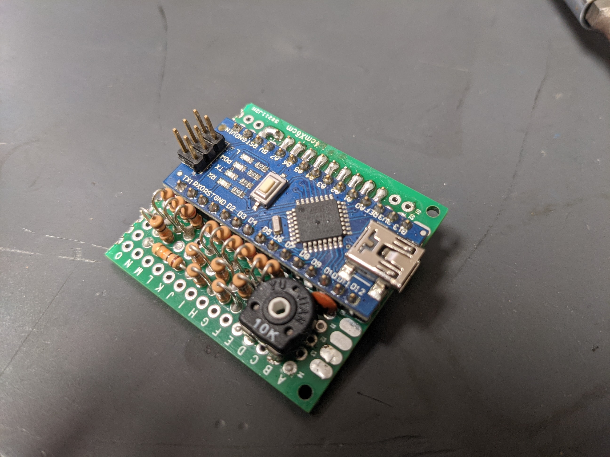
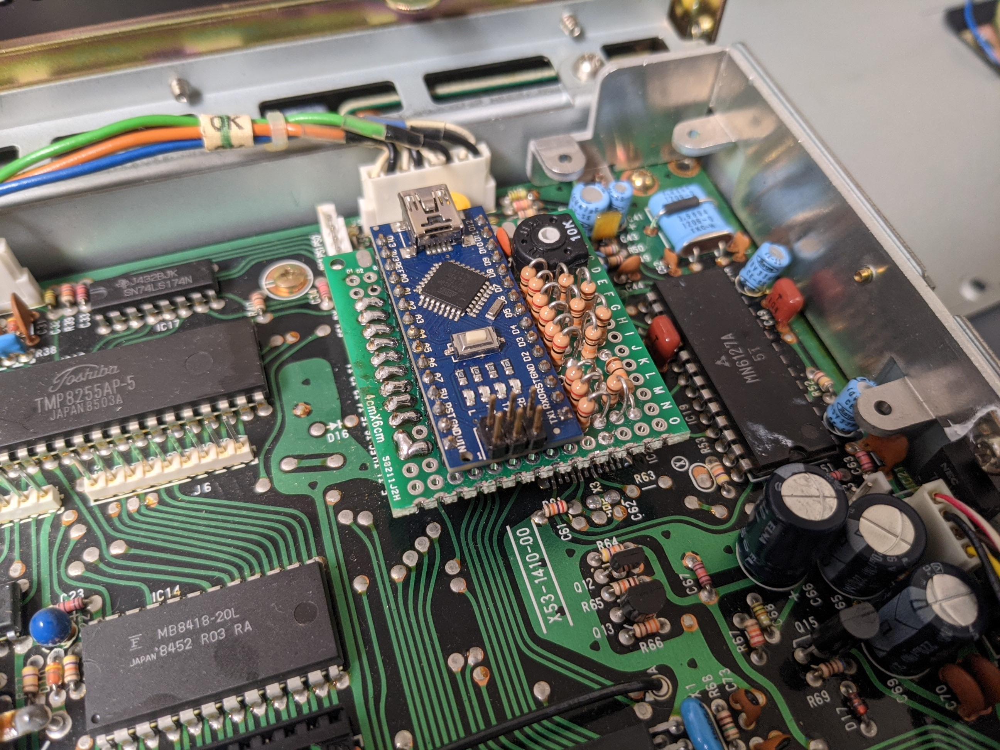

# Tu-5 Drop In Replacement
The Kenwood ts-811a was a base station 70cm radio that advertised having CTCSS capabilities. The radio not only has all the buttons to set and enable CTCSS tones, but all the buttons go to menus too. But the ability to actually generate the desired tone and inject it into the transmission was locked behind an addon you had to buy, the Tone Unit 5 (tu-5).

This project is a modern drop in replacement for the tu-5 since you cannot get one anymore. I made up a schematic using an arduino, and a R2R ladder to read the input from the radio's main processor and then injecting the desired tone back into the radio. Below is a picture of the assembled replacement; I made in to protoboard since I only planned to make one, but someday when I am bored, I plan to design a pcb that will match the original tu-5 form factor while being really flat owing to all smd components.
 

## To Do
1) Layout a pcb that can easily be ordered (preassembled if desired) from a fab house
2) Add RGB for 10% more performance
